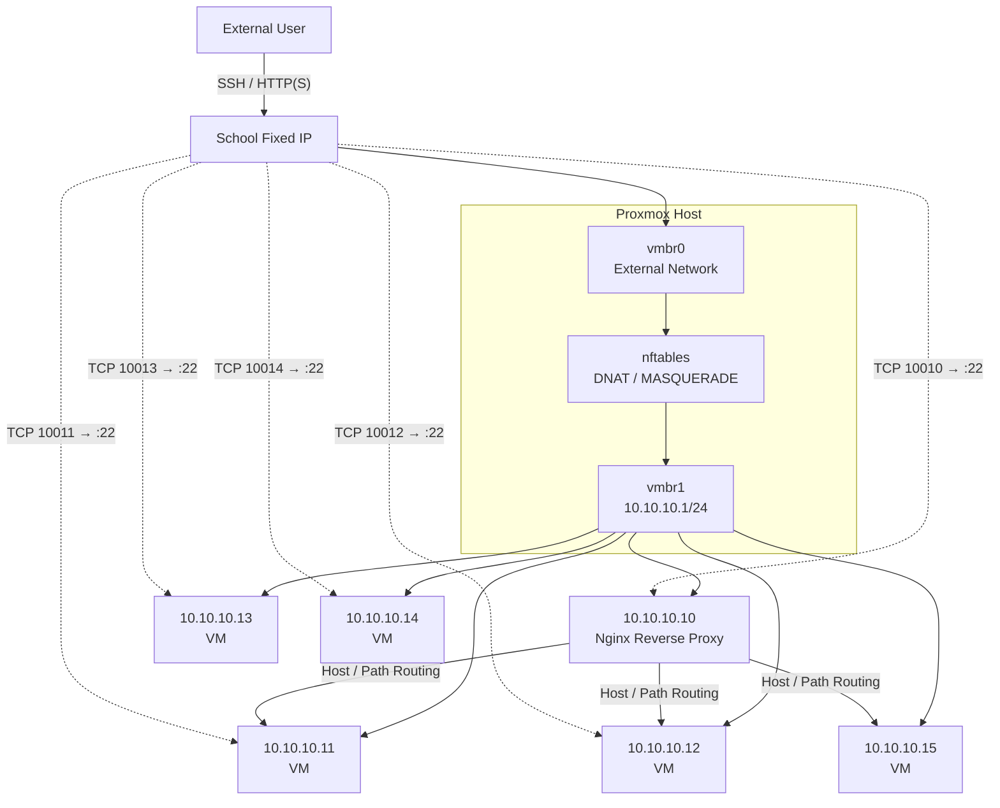

# Proxmox Virtual Network & Reverse Proxy

학교의 제한된 고정 IP 환경에서 여러 VM을 독립적으로 운영하기 위해 구성했던 **Proxmox 가상 네트워크 + nftables NAT/DNAT + SSH 포트포워딩 + Nginx Reverse Proxy** 구조를 포트폴리오 형태로 정리한 저장소입니다.

> 공개 포트폴리오용 문서이므로 실제 학교 외부 IP, 사용자 계정, 현재 운영 중인 민감한 서비스 주소는 제외했습니다.


## 프로젝트 개요

학교 네트워크에서는 VM마다 외부 공인 IP를 자유롭게 할당하기 어려웠습니다. 하지만 Proxmox 내부에서는 여러 VM을 독립적으로 운영해야 했고, 외부에서 각 VM으로 SSH 접속하는 기능과 여러 웹 서비스를 하나의 외부 IP에서 서비스하는 구조가 필요했습니다.

이를 해결하기 위해 네트워크를 다음 계층으로 나누어 구성했습니다.

```text
L2  : Proxmox Linux Bridge
L3  : Private Network / IP Forwarding
L3/4: NAT / MASQUERADE / DNAT
L4  : SSH Port Forwarding
L7  : Nginx Reverse Proxy
```

핵심은 **외부 고정 IP 1개를 Proxmox Host의 진입점으로 사용하고, 내부 VM은 사설망으로 분리한 뒤 목적에 따라 포트포워딩 또는 Reverse Proxy로 전달하는 구조**입니다.

---

## 전체 구조



### 트래픽 분리 방식

| 목적 | 외부 요청 | 처리 방식 | 내부 목적지 |
|---|---|---|---|
| SSH | 고정 IP + 개별 고포트 | nftables DNAT | 각 VM의 TCP 22 |
| Web | 고정 IP + 80/443 | DNAT → Nginx Reverse Proxy | 요청 Host/Path에 맞는 Backend VM |

SSH는 **포트 번호**로 VM을 구분하고, 웹 서비스는 **URL Host 또는 Path**로 서비스를 구분하도록 역할을 나누었습니다.

---

## Proxmox 가상 네트워크

외부 네트워크와 내부 VM 네트워크를 Linux Bridge로 분리했습니다.

```text
vmbr0
 └─ 학교 외부 네트워크
    └─ Proxmox Host의 고정 IP

vmbr1
 └─ 10.10.10.0/24 Private Network
    ├─ 10.10.10.10  Reverse Proxy
    ├─ 10.10.10.11  Backend VM
    ├─ 10.10.10.12  Backend VM
    ├─ 10.10.10.13  Backend VM
    ├─ 10.10.10.14  Backend VM
    └─ 10.10.10.15  Backend VM
```

VM을 외부망에 직접 노출하지 않고 사설망에 배치하여 **Proxmox Host를 네트워크 진입점으로 통일**했습니다.

---

## NAT / IP Forwarding

내부 VM이 Proxmox Host를 통해 외부 네트워크와 통신하도록 Linux IP Forwarding을 사용했습니다.

```bash
sysctl net.ipv4.ip_forward
```

활성화 상태 예시:

```text
net.ipv4.ip_forward = 1
```

내부 VM의 외부 통신에는 `MASQUERADE`를 적용했습니다.

```nft
table ip nat {
    chain postrouting {
        type nat hook postrouting priority srcnat; policy accept;
        ip saddr 10.10.10.0/24 oifname "vmbr0" masquerade
    }
}
```

흐름:

```text
10.10.10.11
    ↓
vmbr1
    ↓
Proxmox Host
    ↓ MASQUERADE
vmbr0
    ↓
External Network
```

---

## SSH 포트포워딩

외부 IP가 하나이기 때문에 외부의 서로 다른 포트를 각 VM의 SSH 22번 포트에 매핑했습니다.

```text
External :10010 → 10.10.10.10:22
External :10011 → 10.10.10.11:22
External :10012 → 10.10.10.12:22
External :10013 → 10.10.10.13:22
External :10014 → 10.10.10.14:22
```

개념적인 nftables 구성:

```nft
table ip nat {
    chain prerouting {
        type nat hook prerouting priority dstnat; policy accept;

        iifname "vmbr0" tcp dport 10010 dnat to 10.10.10.10:22
        iifname "vmbr0" tcp dport 10011 dnat to 10.10.10.11:22
        iifname "vmbr0" tcp dport 10012 dnat to 10.10.10.12:22
        iifname "vmbr0" tcp dport 10013 dnat to 10.10.10.13:22
        iifname "vmbr0" tcp dport 10014 dnat to 10.10.10.14:22
    }
}
```

외부에서는 같은 IP를 사용하되 포트만 구분하여 원하는 VM에 접근할 수 있습니다.

```bash
ssh -p 10011 user@<SCHOOL_FIXED_IP>
ssh -p 10012 user@<SCHOOL_FIXED_IP>
```

---

## Web 트래픽과 Reverse Proxy

웹 서비스는 서비스마다 외부 포트를 다르게 노출하지 않고 80/443을 Reverse Proxy VM으로 집중시켰습니다.

```text
External :80  → 10.10.10.10:80
External :443 → 10.10.10.10:443
```

개념적인 DNAT 규칙:

```nft
iifname "vmbr0" tcp dport 80  dnat to 10.10.10.10:80
iifname "vmbr0" tcp dport 443 dnat to 10.10.10.10:443
```

Reverse Proxy VM의 Nginx가 요청을 확인한 뒤 실제 서비스가 실행 중인 Backend VM으로 전달하도록 구성했습니다.

---

## Path 기반 Reverse Proxy

하나의 주소에서 URL Path를 기준으로 서로 다른 VM으로 요청을 전달하는 방식입니다.

```text
http://<SERVER>/service-a/
        ↓
10.10.10.11:80

http://<SERVER>/service-b/
        ↓
10.10.10.12:80
```

예시:

```nginx
server {
    listen 80;

    location /service-a/ {
        proxy_pass http://10.10.10.11:80/;
    }

    location /service-b/ {
        proxy_pass http://10.10.10.12:80/;
    }
}
```

과거 구성에서는 DuckDNS 주소와 특정 Backend VM을 연결하여 Path 기반 접근을 구성/검토한 기록이 있었습니다. 공개 문서에서는 실제 도메인과 서비스명을 일반화했습니다.

---

## Host 기반 Reverse Proxy

서브도메인을 기준으로 Backend를 나누는 방식은 여러 서비스를 더 명확하게 분리하기 위한 **확장 설계**로 정리했습니다.

```text
service-a.example.com
        ↓
Nginx Reverse Proxy
        ↓
10.10.10.11

service-b.example.com
        ↓
Nginx Reverse Proxy
        ↓
10.10.10.12
```

예시:

```nginx
server {
    listen 80;
    server_name service-a.example.com;

    location / {
        proxy_pass http://10.10.10.11:80;
    }
}

server {
    listen 80;
    server_name service-b.example.com;

    location / {
        proxy_pass http://10.10.10.12:80;
    }
}
```

> Host/Subdomain 기반 분리는 설계 및 확장 방향으로 기록하며, 실제 학교 서버에서 모든 서브도메인 구성이 운영 완료되었다고 과장하지 않습니다.

---

## 장애 분석 방식

접속 문제가 발생하면 전체 시스템을 한 번에 보지 않고 패킷 경로를 기준으로 범위를 좁혔습니다.

```text
External Network
      ↓
Proxmox vmbr0
      ↓
nftables NAT / DNAT
      ↓
vmbr1
      ↓
VM Network
      ↓
SSH / Nginx / Application
```

확인 순서:

```bash
# VM 서비스
ss -lntp
systemctl status ssh

# 내부 네트워크
ping 10.10.10.11
ssh user@10.10.10.11

# Routing
ip addr
ip route
sysctl net.ipv4.ip_forward

# NAT / DNAT
sudo nft list ruleset

# Reverse Proxy
sudo nginx -t
systemctl status nginx
curl -I http://10.10.10.11
```

이 방식으로 문제를 **외부 네트워크 → NAT → Bridge → VM → Application** 단계로 나누어 확인했습니다.

---

## 기술 스택

`Proxmox VE` `Linux` `Linux Bridge` `TCP/IP` `Private Network` `IP Forwarding` `nftables` `NAT` `DNAT` `MASQUERADE` `SSH` `Nginx` `Reverse Proxy`

---

## 결과

- 제한된 외부 고정 IP 환경에서 여러 VM의 독립적인 SSH 접근 구조 구성
- `vmbr0` 외부망과 `vmbr1` 사설망 분리
- `10.10.10.0/24` Private Network 구성
- nftables DNAT 기반 VM별 SSH 포트포워딩
- MASQUERADE 기반 내부 VM의 외부 통신 구성
- 80/443 트래픽을 Reverse Proxy VM으로 집중
- Nginx Path 기반 Backend 서비스 분기
- VM 추가 시 사설 IP와 포트 규칙을 추가하는 방식으로 확장 가능한 구조 확보
- 패킷 이동 경로를 네트워크 계층별로 나누어 장애를 분석하는 경험 확보

---

## 배운 점

이 경험을 통해 단순히 “포트가 열려 있는지”만 보는 것이 아니라 **패킷이 실제 서비스까지 어떤 경로를 거치는지 이해해야 네트워크 문제를 정확히 찾을 수 있다는 점**을 배웠습니다.

또한 가상화 환경에서는 VM 생성 자체보다 외부망과 내부망의 분리, Routing, NAT, 포트포워딩, Reverse Proxy까지 함께 설계해야 실제 다중 사용자 서비스 환경으로 사용할 수 있다는 것을 경험했습니다.

---

## 상세 문서

- [Architecture](docs/architecture.md)
- [Configuration Examples](docs/config-examples.md)

---

## 공개 범위 주의사항

- 실제 학교 외부 고정 IP는 공개하지 않음
- 사용자 계정 및 인증정보는 공개하지 않음
- 현재 사용 중인 서비스 도메인/Endpoint는 일반화
- HTTPS 인증서 자동화는 완료 여부가 확실하지 않아 구축 완료 사항으로 기재하지 않음
- Host/Subdomain 기반 Reverse Proxy는 확장 설계와 실제 구축 범위를 구분하여 작성
